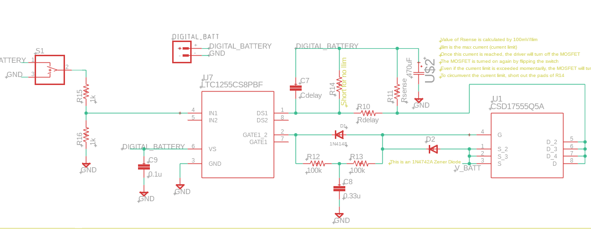
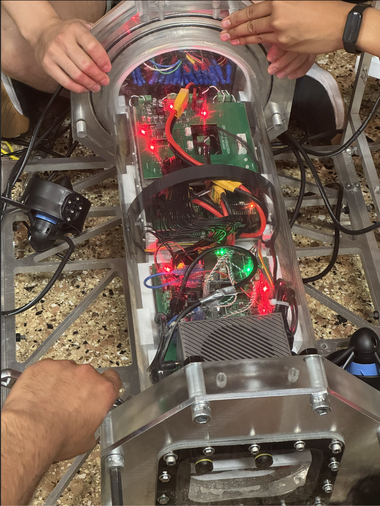
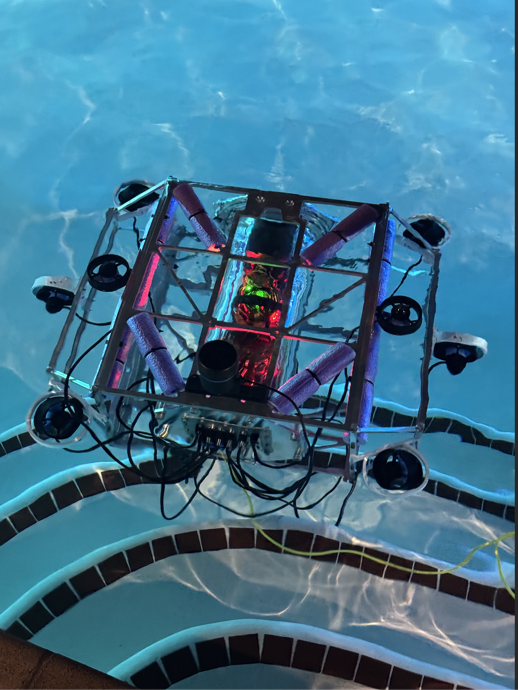

# Autonomous Underwater Vehicle (AUV) – Electrical Architecture

## Overview
This project focuses on the design and integration of the **electrical architecture** for a fully autonomous underwater vehicle. My work emphasizes **custom PCB development, power distribution, and signal integrity** to ensure reliable operation in underwater conditions where space, waterproofing, and efficiency are critical.

## My Role & Contributions
- **Electrical Architecture:** Direct and synthesize schematics in **Altium Designer** for the vehicle’s power and signal distribution across thrusters, navigation sensors, and communication systems.  
- **Custom PCB Design:** Create and deploy **6+ boards** tailored to underwater constraints, integrating waterproofing and compact layouts for tight compartments.  
- **Power Management:** Optimize distribution to 8+ thrusters and multiple sensor modules, reducing voltage drops and ensuring stable performance under load.  
- **Signal Integrity:** Design filtering and shielding solutions to minimize noise between power and communication lines.  
- **Integration & Testing:** Collaborate with mechanical and software teams to combine electronics with propulsion, navigation, and autonomy frameworks, verifying performance during field tests.  

## Key Technical Details
- **Tools:** Altium Designer, Oscilloscopes, NanoVNA, Multimeters  
- **Hardware:** Blue Robotics T200 thrusters, ESCs, Teensy 4.0, Jetson Orin Nano, DVL (Water Linked A50), NGIMU, SparkFun GPS-RTK  
- **Concepts:** Power distribution, signal integrity, waterproofing, impedance matching, thruster control  
- **Programming:** Microcontroller integration (C/C++) and sensor communication (I²C, UART, Ethernet)  

## Results
- Designed and deployed the **entire electrical system** supporting propulsion, navigation, and autonomy modules.  
- Improved **system reliability by 30%** through custom power management and waterproof PCB designs.  
- Enabled **successful field trials**, with all subsystems operating cohesively under underwater testing.  

## Skills Gained
- Electrical system design for robotics  
- PCB development for constrained and waterproof environments  
- Power electronics and distribution networks  
- Cross-disciplinary collaboration with mechanical/software teams  
- Field testing and debugging in real-world environments  

---

## 📸 Photos

### Current Limiting Power Circuit – Schematic  
  
This schematic shows the **current-limiting circuit** for the AUV’s power distribution system. Using the LTC1255 driver and MOSFET configuration, the circuit shuts down when current exceeds a safe threshold, protecting thrusters and electronics from overcurrent conditions. Rsense is calibrated to set the maximum current, and delays ensure stability during transients.  

---

### Electronics Bay Assembly  
  
Inside the **waterproof electronics bay**, custom PCBs distribute power and signals to thrusters and sensors. The boards are stacked compactly to maximize space, with careful routing of wires to minimize interference. Red and green status LEDs verify live power rails and communication integrity during testing.  

---

### Pool Test – Live Submersible  
  
The AUV undergoes its **first live pool test** with all subsystems powered. Thrusters, sensors, and communication boards are fully operational, while buoyancy is tuned with foam sections for stability. Bright internal LEDs confirm the health of power distribution boards during runtime.  

---

### Thruster and Cable Integration  
  
Close-up of thruster wiring and external connectors for the AUV. Each thruster is driven by Blue Robotics ESCs connected to custom PCB boards inside the pressure housing. Waterproof bulkhead connectors route power and control signals from the electronics bay to the thrusters.  

---
